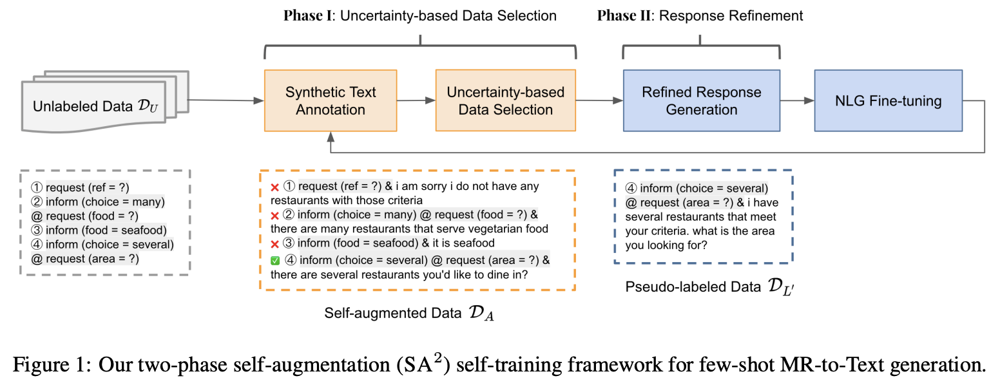
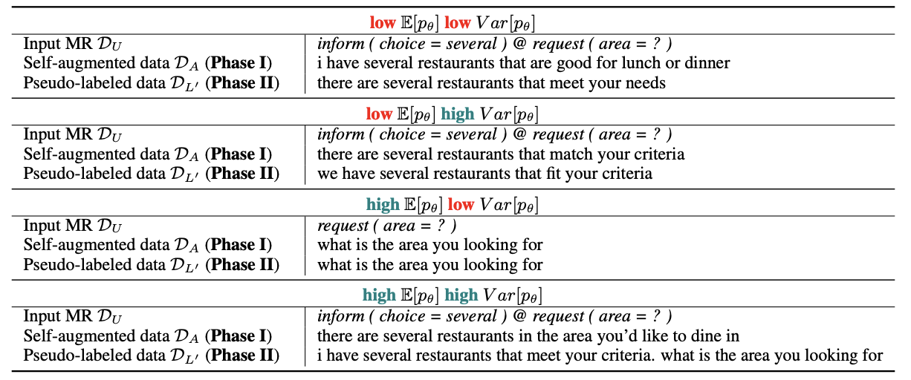
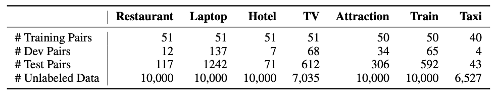
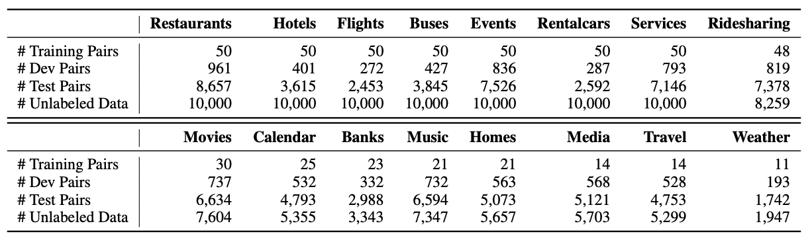

# Self-Training-Dialogue-Generation
This repository contains the data and code for the paper:
> [Self-training with Two-phase Self-augmentation for Few-shot Dialogue Generation](arxiv.org/abs/2205.09661) <br>
> Wanyu Du, Hanjie Chen and Yangfeng Ji <br>
> Findings of EMNLP 2022




## Environment Setup
1. Install and setup the environment:
```
conda env create -f environment.yml
conda activate sa2st
```
2. Download the pretrained scgpt checkpoint, put it under `src`:
```
wget https://bapengstorage.blob.core.windows.net/fileshare/scgpt.tar.gz
tar xvf scgpt.tar.gz
mv scgpt src/
```

## Datasets
1. Data statistics for **FewShotWoz**


2. Data statistics for **FewShotSGD**


## Models
### Inference Only
1. Download the model checkpoints on 2 datasets across all domains (check [here](https://drive.google.com/drive/folders/1HZaiWBOkLD736p50gwl_dbfioQ0mvyuc?usp=share_link)).
2. Put the downloaded checkpoints under `models`.
3. Run the following script to obtain our models' predictions on dev and test set:
```
bash sa2_infer.sh {DATASET} {DOMAIN} {CUDA}
```
`{DATASET}` indicates the dataset, including FewShotWoz, FewShotSGD.<br>
`{DOMAIN}` indicates the domain, including attraction, hotel, laptop, ....<br>
`{CUDA}` indicates the index of the GPU (e.g. 0, 1, 2, 3, ...).


### Self-training and Inference
If you want to train the model from scratch, you can run the following script:
```
bash sa2_woz.sh {DOMAIN} {FLAG} {LR} {EPOCH} {CUDA}
```
`{DOMAIN}` indicates the domain, including attraction, hotel, laptop, ...<br>
`{FLAG}` indicates the model checkpoint name flag.<br>
`{LR}` indicates the learning rate.<br>
`{EPOCH}` indicates the training epoch.<br>
`{CUDA}` indicates the index of the GPU (e.g. 0, 1, 2, 3, ...).


### Evaluation 
The evaluation srcipt is included in `sa2_inference.py` and `sa2_self_training.py`. <br>
The evaluation scores on dev and test set will be saved under the current model checkpoint folder. 


## Citation
If you find this work useful for your research, please cite our paper:
```
@inproceedings{du2022sa,
    title = {Self-training with Two-phase Self-augmentation for Few-shot Dialogue Generation},
    author = {Du, Wanyu and Chen, Hanjie and Ji, Yangfeng},
    journal = {arXiv preprint arXiv:2204.01227},
    year = {2022},
    doi = {10.48550/ARXIV.2205.09661}, 
    url = {https://arxiv.org/abs/2205.09661},  
}
```